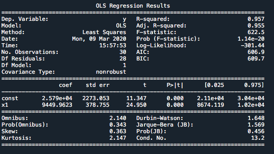

# Simple-Linear-Regression

The data has been fitted a linear regressor due to the high level of correlation between the two variables, this can be observed by the scatter plot below:


This repository contains a simple dataset that is analysed using Simple Linear Regression. 

The output of the code below code (OLS - Ordinary Least Squares) <br />
```
import statsmodels.api as sm <br />
X = np.append(np.ones((30,1)).astype(int), X, axis = 1) <br />
Reg_OLS = sm.OLS(endog = y, exog = X).fit() <br /> 
summary = Reg_OLS.summary() <br />
print(summary) <br />
```
is as follows



From the above output, we can estiablish:

The regressor takes the following equation with the coefficients from the above output:  
Expected_salary = 25790 + 9450*(Years_of_experience)

R-squared and Adj R-Squared are both 0.96

The P values are much lower than 0.05, indicating that the variable X1 (Years of experience) is statistically significant.
