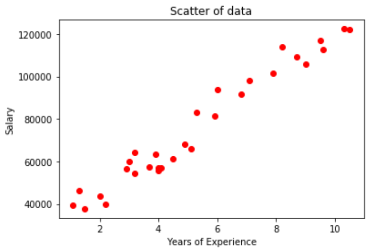

# Simple-Linear-Regression

We will be analysing a simple dataset using Linear Regression. 

The data has been fitted a linear regressor due to the high level of correlation between the two variables, this can be observed by the scatter plot below:



The output of the code below code (OLS - Ordinary Least Squares) <br />
```
import statsmodels.api as sm 
X = np.append(np.ones((30,1)).astype(int), X, axis = 1) 
Reg_OLS = sm.OLS(endog = y, exog = X).fit() 
summary = Reg_OLS.summary()
print(summary) 
```
is as follows

```
                            OLS Regression Results                            
==============================================================================
Dep. Variable:                      y   R-squared:                       0.957
Model:                            OLS   Adj. R-squared:                  0.955
Method:                 Least Squares   F-statistic:                     622.5
Date:                Mon, 09 Mar 2020   Prob (F-statistic):           1.14e-20
Time:                        17:11:27   Log-Likelihood:                -301.44
No. Observations:                  30   AIC:                             606.9
Df Residuals:                      28   BIC:                             609.7
Df Model:                           1                                         
Covariance Type:            nonrobust                                         
==============================================================================
                 coef    std err          t      P>|t|      [0.025      0.975]
------------------------------------------------------------------------------
const       2.579e+04   2273.053     11.347      0.000    2.11e+04    3.04e+04
x1          9449.9623    378.755     24.950      0.000    8674.119    1.02e+04
==============================================================================
Omnibus:                        2.140   Durbin-Watson:                   1.648
Prob(Omnibus):                  0.343   Jarque-Bera (JB):                1.569
Skew:                           0.363   Prob(JB):                        0.456
Kurtosis:                       2.147   Cond. No.                         13.2
==============================================================================
```

From the above output, we can state the below observations:

The regressor takes the following function with the coefficients from the above output:  

Expected_salary = 25790 + 9450*(Years_of_experience)

From the above, we can interpret the following:
- The base salary for a junior with no experience should be a minimum of £25,790
- For every additional year of experience an individual has, their salary is expected to increase by £9,450

R-squared and Adj R-Squared are both 0.96

The P values are much lower than 0.05, indicating that the variable X1 (Years of experience) is statistically significant.
